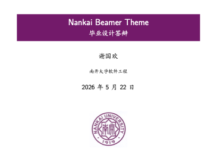
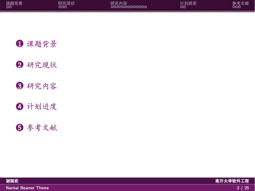
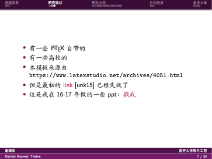
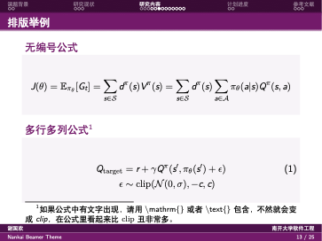
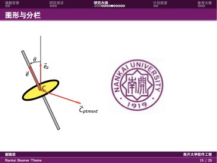

# Nankai-Beamer-Theme

这是一个南开风格的 Beamer 模板，基于原
[THU-Beamer-Theme](https://github.com/Trinkle23897/THU-Beamer-Theme)
修改而来。

原模板最初可追溯到
[latexstudio.net/archives/4051.html](https://www.latexstudio.net/archives/4051.html)，
也曾发布为
[Overleaf 模板](https://www.overleaf.com/latex/templates/thu-beamer-theme/vwnqmzndvwyb)。
本仓库在其基础上替换为南开校徽、南开紫配色和南开相关身份信息。

## 编译

推荐使用 XeLaTeX：

```bash
latexmk -xelatex slide.tex
```

VS Code / LaTeX Workshop 可直接使用仓库内的 `.vscode/settings.json`
配置编译。

## 预览











## 文件说明

- `slide.tex`：模板示例主文件。
- `Nankai.sty`：南开风格 Beamer 主题配置。
- `pic/nankai.jpg`：南开校徽素材。
- `ref.bib`：示例参考文献。

编译产生的 PDF 和 LaTeX 中间产物已在 `.gitignore` 中忽略，不会随仓库提交。
